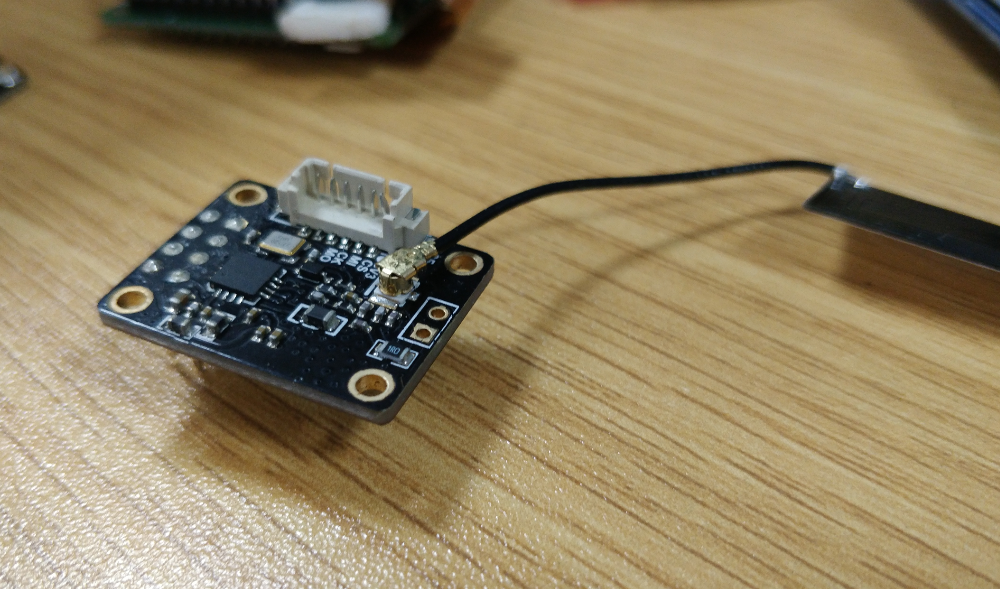

# SPMOD_RFID

## 概述

SPMODE_RFID 采用复旦微电子 FM17510 高度集成的非接触式（13Mhz）的读写芯片。

###  FM17510 芯片介绍

FM17510 是一款高度集成的工作在 13.56MHz 下的非接触读写器芯片，支持符合 ISO/IEC 14443
TypeA 协议的非接触读写器模式。

同时提供了低功耗的外部卡片侦测功能，方便电池供电、需要低功耗工作、并且需要实时处理任意
时刻会进入射频场的外部卡片的读写器设备。
FM17510 具有低电压、低功耗、 单端驱动等特点。适用于低功耗、低电压、低成本要求的非接触读

- FM1750XX 在软硬件层面上兼容 MFRC552，支持工作模式：

- 采用 Sipeed SPMOD (SPI 通讯)接口方便，统一 MaixPy 开发板接口

FM17510  功能特点：

- 支持 ISO/IEC 14443 TypeA 读写器模式

- 读写器模式支持 M1 加密算法

- ISO14443 TYPEA 支持通讯速率 106kbps， 212kbps， 424kbps

- 支持 SPI 串行接口，最高 10Mbps

- Host 接口独立电源供电，电压范围 2.2~3.6V

- 64Byte 收发缓冲 FIFO

- 中断输出模式灵活可配

- 多种低功耗模式

- Soft powerdown 模式

- Hard powerdown 模式

- Deep powerdown 模式（典型值 1uA）

- 支持低功耗外部卡片侦测功能

- 可编程定时器

- 内置振荡电路外接 27.12MHz 晶振

- 宽电压工作范围 2.2V~3.6V

- 内置 CRC 协处理器

- 可编程 I/O 引脚

###  SPMOD_RFID 模块引脚定义：

| 引脚序号 | 引脚名称 | 类型 | 引脚说明                                                     |
| -------- | -------- | ---- | ------------------------------------------------------------ |
| 1        | GND      | G    | 模块电源地                                                     |
| 2        | NSS      | I    | SPI 接口使能                                                 |
| 3        | MISO     | O    | SPI 接口 master 输入 slave 输出                              |
| 4        | NPD      | I    | 复位/休眠（Power Down）控制脚 0 电平时内部电路进入 power down 状态。 当产生一个上升沿时内部电路复位 |
| 5        | IRQ      | O    | 中断输出                                                     |
| 6        | SCK      | I    | SPI 接口时钟输入                                             |
| 7        | MOSI     | I    | SPI 接口 master 输出 slave 输入                              |
| 8        | VCC      | G    | 模块电源 3.3V                                                |
