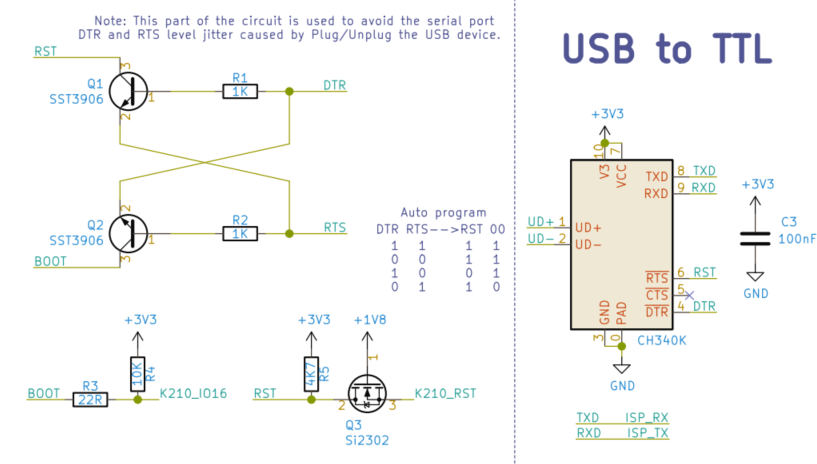

# K210 核心模块

现有四款基于 K210 开发的 AIOT 模块：M1, M1w, M1n, MF0

- 特性说明：

这四款模块都是基于嘉楠堪智科技的边缘智能计算芯片K210（RISC-V架构）设计的。主控芯片内置64位双核高性能低功耗处理器，每个核都有浮点运算单元（FPU），具备卷积人工神经网络智能硬件加速器（KPU）和快速傅里叶变换加速器（FFT）、搭载现场可编程IO阵列（FPIOA），支持多种主流AI编程框架。

### Maix AIOT 模块差异对比

|                            | M1                                                           | M1w                                                         | M1n                                                          | MF0                                                          |
| -------------------------- | ------------------------------------------------------------ | ----------------------------------------------------------- | ------------------------------------------------------------ | ------------------------------------------------------------ |
| 外观                       |  |  |  |  |
| 尺寸                       | 25.4x25.4x3.3（mm）                                          | 25.4x25.4x3.3（mm）                                         | 25.0x22.0x2.7（mm）                                          | 20.0x20.0x4.5（mm）                                          |
| 电压输出（提供给底板使用） | 1.8V和3.3V                                                   | 1.8V和3.3V                                                  | 1.8V和3.3V                                                   | 3.3V                                                         |
| 最大功耗（非瞬态）         | 1.5W                                                         | 3W                                                          | 1.5W                                                         | 1.5W                                                         |
| WIFI功能                   | 无                                                           | 有（K210与ESP8285通过SPI接口和串口连接）                    | 无                                                           | 无                                                           |
| 板载摄像头连接器           | 无                                                           | 无                                                          | 有（仅兼容单摄像头）                                         | 有（仅兼容单摄像头）                                         |
| 引脚形式                   | 邮票孔                                                       | 邮票孔                                                      | NGFF金手指 B-KEY                                             | 2.54mm间距直插焊盘+SMD焊盘                                   |
| 是否引出摄像头信号         | 全引出                                                       | 全引出                                                      | 全引出                                                       | 无                                                           |
| 是否引出屏幕信号           | 全引出                                                       | 全引出                                                      | 全引出                                                       | 无                                                           |
| 引出普通IO口数量           | 48个（全引出）                                               | 48个（全引出）                                              | 44个（IO0-3没引出）                                          | 9个                                                          |

## 模块引脚定义

具体可下载规格书

M1/M1w: https://dl.sipeed.com/MAIX/HDK/Sipeed-M1&M1W/Specifications

M1n: https://dl.sipeed.com/MAIX/HDK/Sipeed-M1n

MF0: https://dl.sipeed.com/MAIX/HDK/Sipeed-MF0/MF0-2802

## M1/M1W(k210) ISP 模式(烧录模式)

更新 K210 时，需要让 K210 进入 ISP 模式，相关信息如下：

- ISP 引脚

  | ISP 引脚 | 描述       | 备注     |
  | ------------- | ---------- | -------- |
  | BOOT (IO_16)         | 启动模式选择 | 低电平进入，ISP 模式 |
  | ISP_RX (IO_4)         | ISP 串口数据接收 |  |
  | ISP_TX (IO_5)         | ISP 串口数据发送 |  |

- Boot 选择

 **IO_16** 用于 **boot** 模式选择，上电时，拉高进入 **Flash** 启动，拉低进入 **ISP** 模式

  | Boot 选择引脚 | 拉高       | 拉低     |
  | ------------- | ---------- | -------- |
  | IO_16         | Flash 启动 | ISP 模式 |

> K210 ISP 模式下，串口波特率建议配置为: 115200，1 停止位，8 数据位，不校验。

- 参考自动进入下载模式电路：

参考来源：

> 《K210技术规格书 v0.1.5》
> - 2.5 特殊引脚:
    IO_16 用于 boot 模式选择，上电复位时，拉高进入 FLASH 启动，拉低进入 ISP 模式。复位后，IO_0、
    IO_1、IO_2、IO_3 为 JTAG 引脚。IO_4、IO_5 为 ISP 引脚。

## 注意事项

> 针对于硬件工程师在设计自己的 PCB 时, 需要注意的事项如下：

- 1、 M1/M1w 模块底部的散热焊盘，需要连接到尽可能大的铜皮，以此提高散热性能

- 2、 每个使用到的 K210 模块引脚和电源引脚，尽量加上 ESD 二极管。ESD 二极管放置的位置根据实际情况选择

- 3、 尽量每个 IO 都串 200R 电阻，保护 IO 端口

- 4、 如果有认证需求，屏幕和摄像头的所有数据线和控制信号，都需要加上 RC 滤波消除过冲和振铃

屏幕信号滤波参数是 100R+100 PF（摄像头信号的滤波元件参数根据实际测试决定

（暂时测定 XCLK 是必须要加 RC 的，其余的可以预留着焊盘））

低通 RC 形式（信号输出先经过电阻后经过电容，RC 元件靠近源端放置）

其他通信类的输出信号也尽量加上RC 滤波（阻值和容值根据实际信号频率决定）

- 5、 模块的 RST 引脚、BANK6/7、摄像头 8 位数据和屏幕 8 位数据的工作电压和容忍电压都是 1.8V，BANK0/1/2/3/4/5 的工作电压和容忍电压都是 3.3V 耐压，一定不能超出耐压范围使用

> 特别注意 RST，如果由外部主控控制 K210 的复位，则需要串联一个低压降的二极管，负极接外部主控引脚，正极接 K210 的 RST 引脚。此外也可以使用电平转换电路进行保护，模块的 RST 复位芯片是开漏输出，已在模块内部加了上拉电阻上拉到 1.8V

- 6、 模块的 5V 是输入，外部给模块供电的；模块的 1.8V 和 3.3V 是模块内部 DC-DC 生成的，主要是给模块内部核心元件使用的，其次是给模块外部的小电流元件使用（比如作为屏幕和摄像头的1.8V参考电压等小电流需求。不建议提供给模块外部的大电流元件使用）

- 7、 如果使用 M1w 模块，则需要遵守天线的摆放原则来摆放 IPEX 2.4G 天线，否则信号会有较大程度的损失（可参考乐鑫的 esp-wroom-02_pcb_design_and_module_placement_guide_cn.pdf）

- 8、 IO16（BOOT）要在底板加 10K 上拉电阻到 3.3V
