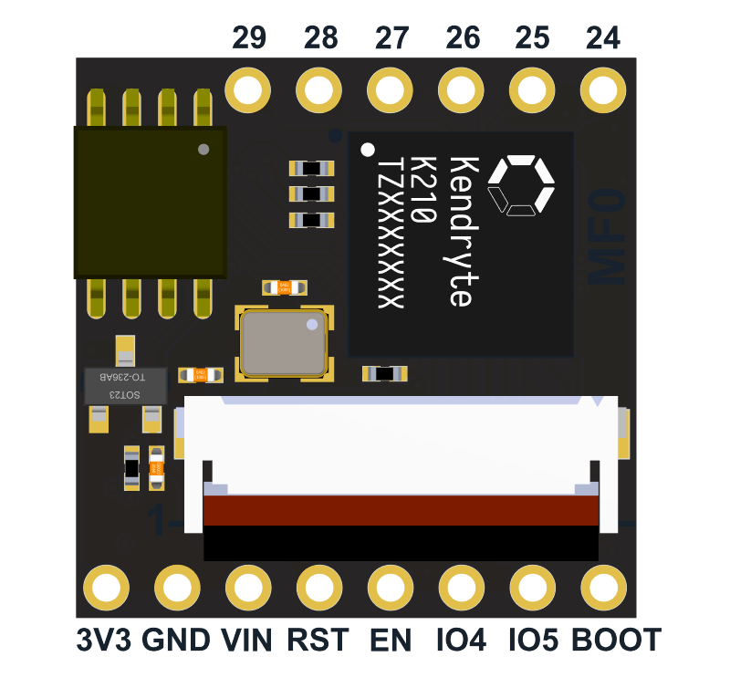

# MF0 机器学习核心模组

## 软硬件概述

MF0 人脸识别模块外观一览

<table border="3">
    <tr>
        <th colspan=2>MF0</th>
    </tr>
    <tr>
        <td width="100">描述</td>
        <td>正面视图</td>
        <td>背面视图</td>
    </tr>
    <tr>
        <td  width="100">MF0 </td>
        <td>
            
            Pin Map 
        </td>
        <td>
            
        </td>
    </tr>
    <tr>
        <td>MF0 Dock</td>
        <td>
            <!--  -->
        </td>
    </tr>
</table>

特性：
- CPU : RISC-V 64bit 双核处理器, 400Mhz 标准频率(可超频)
- 图像识别:QVGA@60FPS/VGA@30FPS
- 深度学习框架:TensorFlow/Keras/Darknet
- 外设:FPIOA、UART、GPIO、SPI、I²C、I²S、WDT、TIMER、etc
- 2.54mm 间距 DIP/SMT 焊盘
- 能连接到面包板
- 板载摄像头连接器

## 协议

串口协议：

MF0 有两种协议固件，方便用户根据具体需求使用

- HEX 格式串口协议固件
- JSON 格式串口协议固件

##
