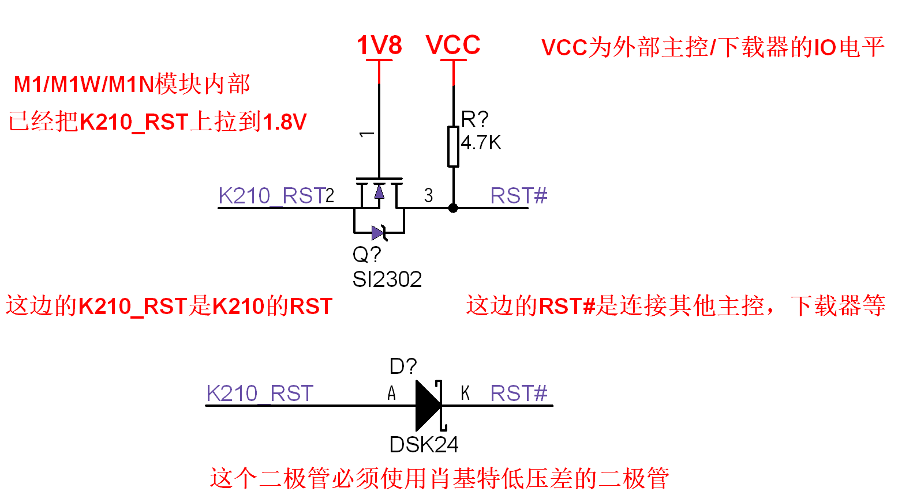

# MF PCB 设计注意事项

注意事项：

1、850nm 红外补光灯可以考虑选用 1W 或者 3W 功率的灯珠，因为更大功率的灯珠可以延长使用寿命、减少故障率和提高识别效果

2、红外灯珠和白光灯珠的驱动电路和元件参数，一定要根据实际灯珠选型和数量决定。因为不同的电路成本不一样，亮度感觉不一样，不同客户的需求不一样，因此客户需要根据实际情况选择和调整参数。强烈建议使用光度计去控制整个设计调试和批量生产的红外灯珠亮度的一致性

3、850nm 光线具有一定的穿透性。 目前已证实红外补光灯的 850nm 光线会从摄像头模组的四周和后背穿透进去，影响成像，进而影响屏幕画面或者影响识别效果。 因此必须在摄像头和补光灯之间，用 850nm 无法穿透的材料/喷漆/胶布等阻隔从灯珠散射到摄像头内部的红外光线。 另外，也可以通过拉开红外灯珠与摄像头的距离，距离保持 15mm 以上就能减少 80% 的负面影响，距离保持 20mm 以上，红外线就基本不会透射进摄像头了

4、红外补光灯与外壳前盖板（亚克力/塑料等材质）之间的距离应尽量少，即补光灯与盖板尽量紧贴。如果补光灯与盖板距离较大，会严重影响识别效果。

5、M1/M1w 模块底部的散热焊盘，需要连接到尽可能大的铜皮，以此提高散热性能

6、白光灯珠和红外灯珠的焊盘，需要连接到尽可能大的铜皮，以此提高散热性能

7、白光补光灯对地的电容应该去掉，否则会导致开灯的时候复位

8、如果需要做电容触摸，尽量把触摸芯片放到靠近手指触摸的位置之下。因为触摸芯片到触摸面板之间的走线长度，长度越长越难把握灵敏度、越容易受干扰

9、每个使用到的 K210 模块引脚和电源引脚，尽量加上 ESD 二极管。ESD 二极管放置的位置根据实际情况选择

10、如果有认证需求：

 - 所有的输出信号都要在靠近模块的地方加上 RC 低通滤波电路，消除过冲和振铃。

 - RC 参数是 100R+100PF（这是屏幕信号的参数，其他信号必须根据实际测试决定，不能影响正常功能）。 低通 RC 形式是指：信号从模块输出先经过电阻后经过电容，RC 元件靠近模块（ 源端）放置。

 - 目前已知需要加 RC 滤波的信号：屏幕的所有信号、摄像头的 XCLK 信号、串口的 TX 信号、给 DAC 芯片的 i2s 信号、其他高频输出信号

11、尽量每个 IO 都串 200R 电阻和加 ESD 二极管，保护 IO 端口

12、M1/M1w 模块的 RST、BANK6/7、摄像头 8 位数据和屏幕 8 位数据的工作电压和容忍电压都是 1.8V，BANK0/1/2/3/4/5 的工作电压和容忍电压都是 3.3V 耐压，一定不能超出耐压范围使用。如果要把 RST 引脚引出使用，强烈建议增加保护电路，以下两种电路都可以起到保护/兼容更高电平的作用：

13、模块的 5V 是输入，外部给模块供电的；模块的 1.8V 和 3.3V 是模块内部 DC-DC 生成的，主要是给模块内部核心元件使用的，其次是给模块外部的小电流元件使用（比如作为屏幕和摄像头的 1.8V 参考电压等小电流需求。不建议提供给模块外部的大电流元件使用）

14、如果使用 M1w 模块，则需要遵守天线的摆放原则来摆放 IPEX 2.4G 天线，否则信号会有较大程度的损失

15、IO16（BOOT）要在底板加 10K 上拉电阻到 3.3V

16、FPIOA 允许用户将 255 个内部功能映射到芯片外围的 48 个自由 IO 上

17、M1 和 M1w 的区别是：M1 没有 WIFI，M1w 有 WIFI，M1w 模块的 IO0-IO3 这 4 个引脚是 K210 与 WIFI(ESP8285) 芯片之间的 SPI 连接，因此不能用作其他用途

18、请一定要在 PCB 上预留 M1/M1w 模块的 K210 和 WIFI 的下载接口，具体可以参考我们提供的标案原理图
